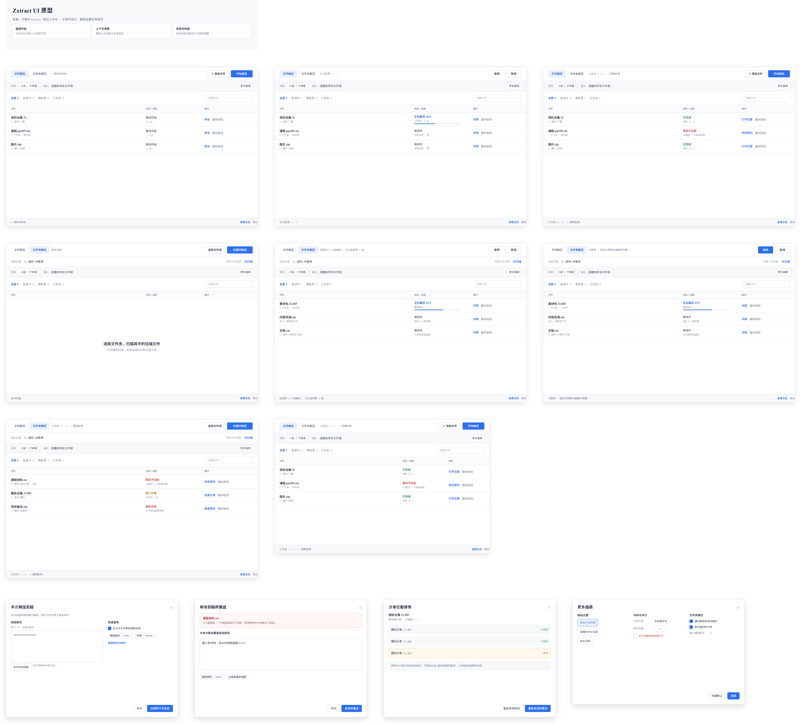
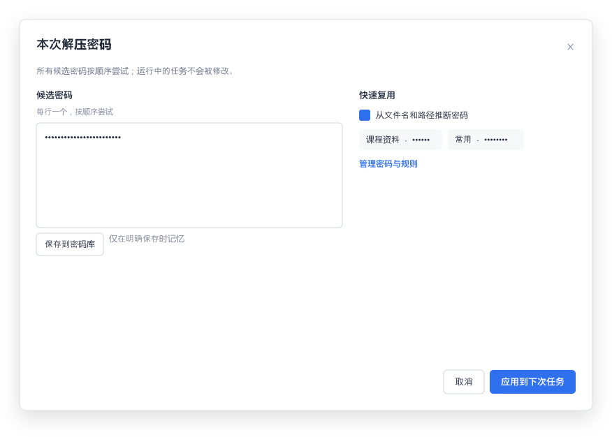

# Zxtract

Zxtract 是一款面向 Windows 的现代化压缩文件工作台：把单文件解压、整目录扫描、分卷归并、密码管理和嵌套压缩递归处理放进一个清晰的界面。

Zxtract is a focused Windows archive workbench that combines one-off extraction, folder scanning, split-volume recovery, password management, and recursive nested-archive processing in one calm, practical UI.

## 软件简介 · Product overview

**为“压缩包很多、目录很深、密码不统一”的真实场景设计。**

Zxtract 的核心优势：

- **双模式工作流**：单独解压文件，或扫描整个文件夹；两种模式互不干扰。
- **智能分卷处理**：识别 `.7z.001/.002`、多卷 RAR，并可将分散目录中的同名分卷归并后再解压。
- **递归解压**：解压结果中发现新的压缩包后自动继续处理，并用轮次和循环检测避免重复工作。
- **密码助手**：支持多个候选密码、路径推断、自定义规则和本地密码库；密码库使用当前 Windows 用户的 DPAPI 保护。
- **可恢复任务**：失败、取消、密码错误和缺少分卷的任务保留来源路径，可快速重试，不必重新选择文件。
- **安全默认值**：默认保留源文件；只有成功完成的任务才允许删除源压缩包。
- **轻量且可移植**：Release 包自带 7-Zip 引擎，适合直接解压后使用。

**Built for messy archive collections.** Zxtract is designed for folders full of mixed formats, split archives stored in different places, inconsistent passwords, and archives nested inside extracted results.

Highlights:

- Two focused workflows: individual archives and whole-folder processing.
- Automatic split-volume grouping for 7z and multi-volume RAR archives.
- Recursive extraction with pass limits and cycle protection.
- Candidate passwords, path inference, custom rules, and a DPAPI-protected local vault.
- Retry failed or canceled jobs from their preserved source paths.
- Safe-by-default source handling: deletion is opt-in and only happens after success.
- Portable Windows Release package with the 7-Zip engine included.

## 界面预览 · UI preview

主界面将模式页签、共享密码栏、任务列表和底部状态区固定在清晰的层级中；任务区域支持等待、处理中、已完成、暂停和需处理等状态。

The main window keeps mode tabs, shared password controls, the task list, and status actions in a predictable hierarchy. The design covers ready, running, completed, paused, and attention states.



共享密码面板支持逐行候选密码、密码库快速复用和路径规则推断。

The shared password panel supports one-password-per-line candidates, quick reuse from the vault, and path-based inference rules.



可编辑的 OpenPencil 设计源文件位于 [design/openpencil/Zxtract.fig](design/openpencil/Zxtract.fig)，重建脚本位于 [tools/Sync-ZxtractOpenPencil.ps1](tools/Sync-ZxtractOpenPencil.ps1)。

The editable OpenPencil source is [design/openpencil/Zxtract.fig](design/openpencil/Zxtract.fig); the reproducible rebuild script is [tools/Sync-ZxtractOpenPencil.ps1](tools/Sync-ZxtractOpenPencil.ps1).

## 使用方式 · Usage

### 图形界面 · GUI

1. 点击 **添加压缩文件...**，选择一个或多个压缩包，然后点击 **开始文件解压**（`F5`）。
2. 处理整个目录时，选择根目录，再点击 **仅扫描** 或 **扫描并解压**。
3. 密码在顶部共享栏中配置；每行一个候选密码，按顺序尝试。
4. 失败或取消的任务可选择后点击 **重试选中**；**复制路径** 可快速复用来源路径。
5. 文件和文件夹也可以直接拖入窗口。

1. Choose **Add archives...**, then click **Start file extraction** (`F5`).
2. For folder mode, choose a root directory and click **Scan only** or **Scan and extract**.
3. Configure candidate passwords in the shared password bar, one candidate per line.
4. Select a failed or canceled task and click **Retry selected**; **Copy path** reuses its source quickly.
5. Files and folders can also be dropped onto the window.

### 递归命令行 · Recursive command line

```powershell
powershell.exe -NoProfile -ExecutionPolicy Bypass -File .\tools\Expand-ArchiveTree.ps1 `
  -Root "D:\archive-root\解压密码：示例密码" -DeleteArchives
```

或者将文件夹拖到 `tools\Extract-ArchiveTree.cmd`。

Or drop a folder onto `tools\Extract-ArchiveTree.cmd`.

## 密码与数据安全 · Password and data safety

密码助手支持内置规则 `解压密码`、`密码`、`p`、`pass`、`password`、`pwd`，也支持自定义模板，例如 `提取码：{password}`。自定义规则和密码库保存在：

The password assistant includes built-in rules for `解压密码`, `密码`, `p`, `pass`, `password`, and `pwd`, and accepts custom templates such as `提取码：{password}`. Settings are stored at:

```text
%LOCALAPPDATA%\Zxtract\password-settings.json
```

仅保存规则文本和 DPAPI 保护后的密码数据，不会把明文密码写入运行日志。

Only rule text and DPAPI-protected password blobs are stored; plaintext passwords are not written to the run log.

## 构建与正式版 · Build and Release

需要 .NET 8 SDK 和 Windows。开发构建：

Requires the .NET 8 SDK on Windows. Development build:

```powershell
dotnet build .\src\ExtractUtil.App\ExtractUtil.App.csproj -c Release
```

生成可分发的 Windows x64 独立版本：

Create a self-contained Windows x64 package:

```powershell
pwsh .\tools\Publish-Zxtract.ps1 -Version 1.0.0
```

The equivalent direct command is:

```powershell
dotnet publish .\src\ExtractUtil.App\ExtractUtil.App.csproj `
  -c Release -r win-x64 --self-contained true `
  -p:PublishSingleFile=true -p:IncludeNativeLibrariesForSelfExtract=true `
  -o .\artifacts\Zxtract-1.0.0-win-x64
```

正式版本当前为 **1.0.0**。发布说明见 [docs/release-notes/v1.0.0.md](docs/release-notes/v1.0.0.md)。

The current formal version is **1.0.0**. See [docs/release-notes/v1.0.0.md](docs/release-notes/v1.0.0.md) for release notes.

## 文档 · Documentation

- [需求说明 · Requirements](docs/requirements.md)
- [技术说明 · Technical notes](docs/technical.md)
- [模块说明 · Modules](docs/modules.md)
- [界面重设计方案 · UI redesign proposal](docs/ui-redesign-proposal.md)
- [OpenPencil 原型状态 · Prototype status](docs/figma-prototype-status.md)
