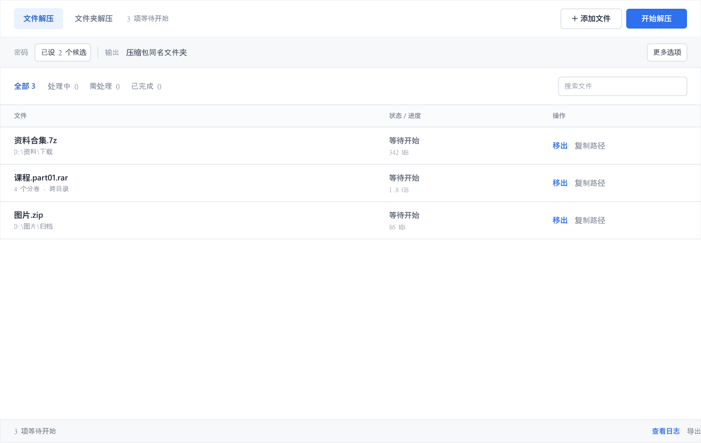
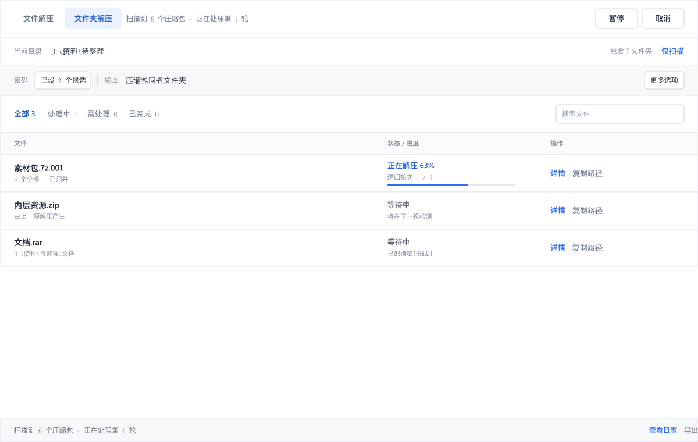
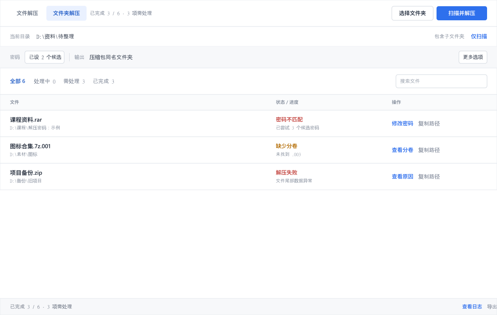

# Zxtract

<p align="center">
  <a href="README.md">English</a> · <strong>简体中文</strong>
</p>

<p align="center">
  <a href="https://github.com/ColonelDarcy2018/Zxtract/releases/latest"></a>
  
  <a href="LICENSE"></a>
</p>

Zxtract 是一个 Windows 桌面解压工具，主要用来处理成批压缩包：普通压缩文件、分卷、带密码文件，以及解压后又出现压缩包的目录。

你可以直接加入几个文件，也可以选择一个根目录。Zxtract 会整理属于同一组的分卷、按顺序尝试候选密码、并行执行任务，并把每个文件的结果留在任务列表中。

> Zxtract 只负责解压，不提供压缩包创建或编辑功能。

## 功能概览

- 文件解压与文件夹扫描是两个独立工作流。
- 通过随包提供的 7-Zip 引擎处理 ZIP、7Z、RAR、TAR 及常见的压缩 TAR 格式。
- 识别并检查数字分卷、`partN.rar` 和旧式 RAR 分卷。
- 可递归处理解压结果中出现的新压缩包。
- 支持多组候选密码、路径推断、自定义规则和本地密码库。
- 支持暂停、取消、筛选、搜索、重试、打开位置和导出日志。
- 默认保留源文件；遇到同名输出时默认改名，不直接覆盖。

## 界面与使用流程

下面的图片来自项目内可编辑的界面原型，展示的流程与当前 WPF 应用相对应。完整设计源文件见 [`design/openpencil/Zxtract.fig`](design/openpencil/Zxtract.fig)。

### 1. 直接加入压缩文件

少量、位置明确的压缩包可使用 **文件解压**。一次加入多个文件，确认输出方式和候选密码后启动队列。每一行集中显示来源、状态、进度和当前可用操作。



### 2. 扫描整个目录

压缩包散落在多层文件夹时使用 **文件夹解压**。**仅扫描** 只生成任务列表，不会开始解压；**扫描并解压** 会继续处理发现的任务。文件夹模式还能归并位于相邻目录的分卷，并按轮次发现嵌套压缩包。



### 3. 只处理需要关注的任务

缺少分卷、密码不匹配或解压失败的任务会保留在列表中。对应行会说明原因，并给出修改密码、检查分卷或重试等操作，不必重新建立整批任务。



### 4. 复用密码，但不写进日志

候选密码按行、按顺序尝试。Zxtract 可以从文件名和目录名推断密码，也可以复用本地密码库中的条目；密码修正后可直接应用到失败任务。


保存的密码使用当前 Windows 用户的 DPAPI 保护。程序只在 `%LOCALAPPDATA%\Zxtract\password-settings.json` 中保存加密数据和规则文本，不会把明文密码写进运行日志。

## 下载与运行要求

正式包面向 **64 位 Windows 10/11**，已经包含 .NET 运行时和 7-Zip 解压引擎。

1. 从 [GitHub Releases](https://github.com/ColonelDarcy2018/Zxtract/releases/latest) 下载最新的 `Zxtract-<版本>-win-x64.zip`。
2. 将 ZIP 完整解压到一个可写目录。
3. 运行 `Zxtract.exe`。

正常使用不需要管理员权限。资源管理器右键菜单注册到当前用户，不修改整机范围的文件关联。

当前正式包尚未代码签名，因此 Windows SmartScreen 可能显示“未知发布者”。运行前请对照发布说明和公开的校验值检查下载文件。

## 快速开始

### 解压指定文件

1. 打开 **文件解压**，点击 **添加文件**（`Ctrl+O`），也可以直接把压缩包拖进窗口。
2. 如果文件带密码，展开密码面板；每行填写一个候选密码。
3. 在 **更多选项** 中确认输出位置、冲突策略和并行任务数。
4. 点击 **开始解压**（`F5`）。

### 处理整个文件夹

1. 打开 **文件夹解压**，选择根目录。
2. 用 **仅扫描**（`Ctrl+S`）先检查任务列表，或直接点击 **扫描并解压**。
3. 在 **更多选项** 中按需调整递归解压、跨目录归并分卷和源文件删除。
4. 运行结束后查看 **需处理**，只重试受影响的任务。

### 快捷键

| 快捷键 | 操作 |
| --- | --- |
| `Ctrl+O` | 添加压缩文件 |
| `F5` | 开始文件解压 |
| `Ctrl+S` | 扫描选定文件夹 |
| `Ctrl+Shift+E` | 导出运行日志 |

## 支持的输入

| 类型 | 可识别的输入 |
| --- | --- |
| 普通压缩文件 | `.zip`、`.7z`、`.rar`、`.tar`、`.gz`、`.bz2`、`.xz`、`.tgz`、`.tar.gz`、`.tar.bz2`、`.tar.xz` |
| 数字分卷 | `.7z.001`、`.7z.002`……以及 `.zip.001`、`.zip.002`…… |
| RAR 分卷 | `.part1.rar`、`.part2.rar`……以及旧式 `.rar`、`.r00`、`.r01`…… |

最终能否成功解压取决于随包提供的 7-Zip 引擎。处理分卷时，请确保所有分卷都可访问，并从第一卷开始。

## 输出与安全策略

- 默认输出到压缩包旁边的同名子文件夹。
- 遇到同名输出时默认改名，不直接覆盖原文件。
- 默认不删除源压缩包；删除选项只在文件夹模式中显式开启。
- GUI 仅在 7-Zip 正常退出后删除源文件；相关分卷按一组处理。
- 递归流程设置了轮次、深度、任务数量和循环检查，避免无限处理。
- 无法读取的文件系统条目和不完整分卷会明确报告，不会静默忽略。

## 递归 PowerShell 工作流

仓库内还提供了适合无人值守处理压缩包目录树的脚本：

```powershell
powershell.exe -NoProfile -ExecutionPolicy Bypass -File .\tools\Expand-ArchiveTree.ps1 `
  -Root "D:\archive-root\解压密码：示例密码" -DeleteArchives
```

也可以把文件夹拖到 [`tools/Extract-ArchiveTree.cmd`](tools/Extract-ArchiveTree.cmd) 上。需要保留源压缩包时，不要传入 `-DeleteArchives`。

## 从源码构建

需要 Windows 和 .NET 8 SDK。

```powershell
dotnet build .\src\ExtractUtil.App\ExtractUtil.App.csproj -c Release
```

生成 Windows x64 自包含发布包：

```powershell
pwsh .\tools\Publish-Zxtract.ps1 -Version 1.0.1
```

发布脚本会先检查应用程序、7-Zip 二进制文件和必要的许可文件，再生成 ZIP。

对本地目录执行一次快速扫描检查：

```powershell
dotnet run --project .\tools\ExtractUtil.Smoke\ExtractUtil.Smoke.csproj -c Release -- scan "D:\archive-root"
```

## 常见问题

<details>
<summary>Zxtract 会上传文件或密码吗？</summary>

不会。解压和密码处理都在本机完成；项目不包含远程下载或云端集成功能。
</details>

<details>
<summary>为什么分卷任务显示“需处理”？</summary>

可能缺少第一卷、分卷序号中间有空缺，或两个文件占用了同一个分卷序号。打开任务详情，补齐或整理文件后重新扫描即可。
</details>

<details>
<summary>需要另外安装 7-Zip 吗？</summary>

正式便携包不需要，里面已经包含 `7z.exe` 和 `7z.dll`。从源码运行时，也可以通过 `EXTRACTUTIL_7Z_PATH` 环境变量指定自己的 7-Zip 可执行文件。
</details>

## 文档

- [需求说明](docs/requirements.md)
- [技术设计](docs/technical.md)
- [模块说明](docs/modules.md)
- [界面重设计说明](docs/ui-redesign-proposal.md)
- [原型状态](docs/figma-prototype-status.md)
- [1.0.1 发布说明](docs/release-notes/v1.0.1.md)

## 参与贡献与问题反馈

欢迎提交问题和范围明确的 Pull Request。报告问题时，请提供 Zxtract 版本、Windows 版本、压缩包的目录结构、预期结果、实际结果，以及已经去除密码和私人路径的日志。改动范围较大时，建议先提交 [Issue](https://github.com/ColonelDarcy2018/Zxtract/issues)，确认预期行为后再实现。

## 开源协议

Zxtract 自有代码和资源采用 [MIT License](LICENSE)。发布包包含未修改的官方 7-Zip 二进制文件，它们继续遵循各自的 LGPL、BSD 和 unRAR 限制条款。详见 [THIRD-PARTY-NOTICES.md](THIRD-PARTY-NOTICES.md) 和 [7-Zip 官方许可](licenses/7-Zip-License.txt)。
